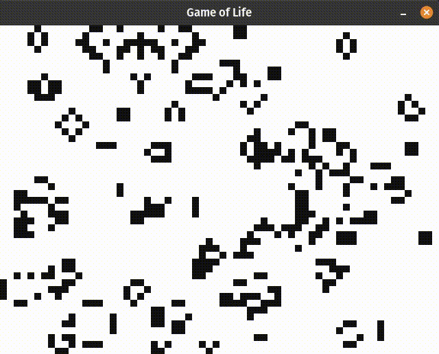

# game_of_life

Conway's Game of Life, in Ruby.



## Installation

```bash
bundle install
```

*`ruby2d` installation might fail if the SDL2 library hasn't been installed. See [here](https://www.ruby2d.com/learn/linux/#install-packages)*

## Run the Game

```bash
bundle exec rake
```

### Options

```bash
Usage: rake [options]
    -w, --width [WIDTH]              Width of the game board
        --height [HEIGHT]            Height of the game board
    -m, --mode [MODE]                Rendering mode, console by default
                                     console, gui
    -h, --help                       Help
```

### Example

```bash
bundle exec rake -- --width=64 --height=48 --mode=gui
```

#### Caveats

*`gui` mode requires `ruby2d` to be installed. Check it out [here](https://www.ruby2d.com/learn/get-started/).*

## Run the Specs

```bash
bundle exec rake spec
```
